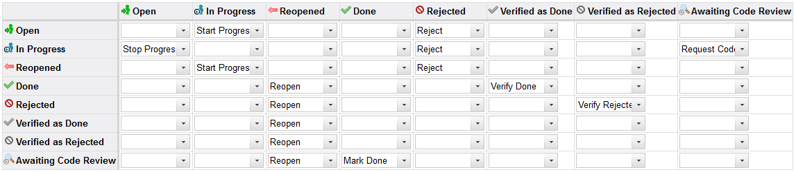
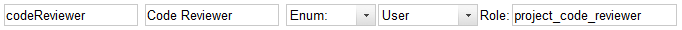
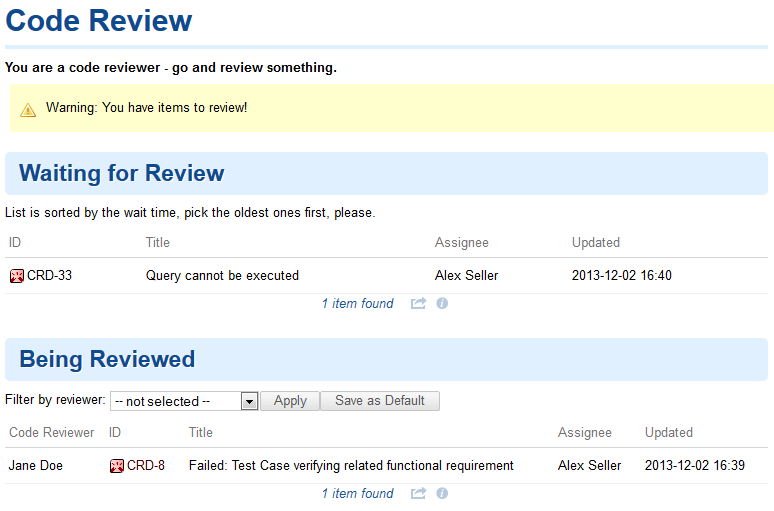
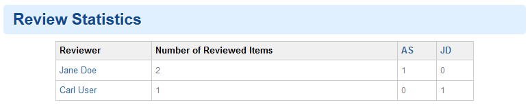
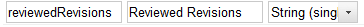
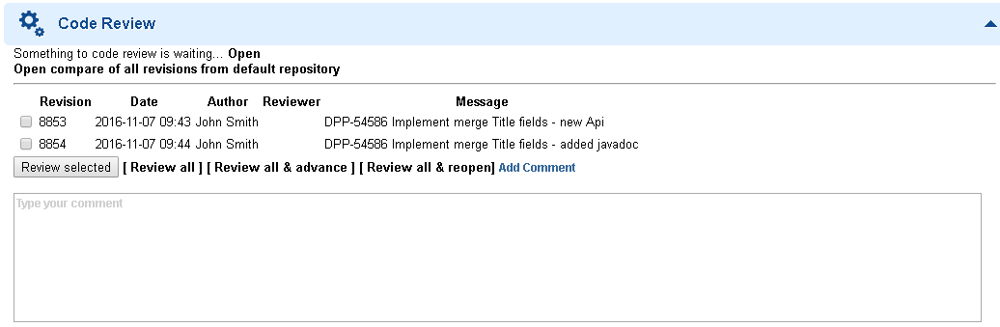
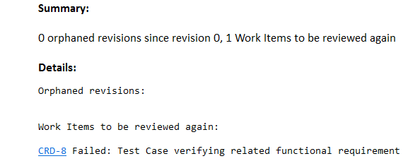

# Code Review Extension for Polarion® ALM™

Copyright 2016 Polarion AG  
TextDiffMatchPatch.java Copyright (C) 2012 Tine Kondo  
TextDiffMatchPatch.java Copyright (C) 2006 Google Inc.  
highlight.js Copyright (C) 2006 Ivan Sagalaev  
jQuery v3.0.0 Copyright jQuery Foundation and other contributors  
Sticky-kit v1.1.2 by Leaf Corcoran  

This Polarion® ALM™ extension provides the ability to do code reviews through the Polarion portal.

## Requirements

- Polarion® ALM™ 2016 or newer
- Java 8 or newer

## Installation

1. Download the packaged extension from http://extensions.polarion.com/extensions/235-code-review-in-polarion
2. Stop the Polarion server.
3. Extract `com.polarion.alm.extensions.codereview.zip` to `<Polarion Installation>/polarion/extensions`.
4. Start the Polarion server.

## Code Review Process in Two Simple Steps

Code reviews help spread knowledge, catch bugs in advance and reduce technical debt. Together with test-driven development or pair
programming they can greatly increase code quality and maintainability. It's a useful Polarion feature that we find invaluable while developing Polarion itself. It improves productivity and catches errors that would have otherwise have slipped through the cracks.

So now that you are convinced that code review is a must-have, the question is, how to approach it? There are various tools for
various version control systems, but you have Polarion and would like something integrated. Or you want to start quickly and maybe
transition to something more robust later. We will show you how to do a code review in just two simple steps based on our experience.

In Step 1 we will present a task-centric code review process suitable for all. If you would like to have more fine-grained reviews then the commit-centric process extension described in Step 2 is the way to go.

### Step 1: Track Tasks for Review

OK, so you have decided that code review is what you need. What is absolutely necessary to define? Who is going to do the reviews and
how will the reviews be tracked?

Reviewers are pretty straightforward, since a project role for that purpose is easy to set up and quite logical. For review tracking we
recommend a special workflow status that is not bypassable and that every implementation task must go through. In our experience the
best place for it is right before QA does the final test round/sign off on the implementation.



Lastly we recommend tracking who is doing the review in a "User enumeration" custom field.  (Available since Polarion 2012 SR3):



To make it easier for code reviewers, we have included a special “Code Review” Wiki page that lists the items waiting to be reviewed and the items currently under review.



Just create new Wiki page and copy the content of the `code_review_wiki.txt` file from the `docs` folder as its Wiki Markup source. Then  the following minor configuration adjustments will be needed at the top of the page:

```
 #set($codeReviewerRole = "project_code_reviewer")
 #set($awaitingCodeReviewQuery = "status:awaiting-code-review")
 #set($codeReviewerField = "codeReviewer")
 #set($projectId = $page.space.projectId)
```

- `codeReviewerRole` should contain the name of the role added for code reviewers.
- `awaitingCodeReviewQuery` should contain the query that selects tasks waiting to be reviewed. (In our case it selects all tasks with a  “awaiting-code-review” status.)
- `codeReviewerField` should contain the id of the field that lists the user doing the review.
- `projectId` can be changed to point to a different project.

How does it look in practice? A Developer commits their work and marks the task available for review by changing its status. A pack of hungry reviewers sees the task on the top of the Code Review page and compete to see who gets to review it first. Once the item
is reviewed, it is pushed to QA, (if the developer is lucky), or sent back to the developer if their luck has run out. In accordance with the Agile Manifesto we promote people over process and advise reviewers to speak with the developer rather than just changing the status of the task and writing a comment.

To promote a little friendly competition there is also a Review Statistics section at the bottom of the Code Review. Just for fun. Mostly.

(Visible only if [Wiki Scripting Tools](http://extensions.polarion.com/extensions/83-wiki-scripting-tools) are installed.)



### Step 2: Track Commits for Review

Let's say your code is in Polarion’s default Subversion repository and all those fancy code reviewing tools that are online and work only with Git are of no use to you. Not to mention you still want to be able to work on the revision level. Or perhaps your code is in Git, but you do not want to leave the comfort of the Polarion portal. Well, don’t despair, we have something for you.

First add the Code Review Form Extension to the Form Layout Configuration, (in Administration / Work Items / Form Configuration) like this:

```xml
<extension id="codereview" label="Code Review"/>
```

Then add a new custom field that will hold the information about reviewed revisions and will be filled in by the Code Review Form Extension.



Finally add the configuration for the Code Review extension by creating a new `.polarion/codereview/codereview.properties` file inside the repository folder of your project with content similar to this:

```ini
reviewedRevisionsField=reviewedRevisions
reviewerField=codeReviewer
inReviewStatus=awaiting-code-review
successfulReviewWorkflowAction=mark_done
successfulReviewResolution=fixed
unsuccessfulReviewWorkflowAction=reopen
reviewerRole=project_code_reviewer
preventReviewConflicts=true
reviewCommentTitle=Review Comment
successfulReviewCommentTitle=Successful Review Comment
unsuccessfulReviewCommentTitle=Unsuccessful Review Comment
``` 

- `reviewedRevisionsField` should contain the id of the field that lists the reviewed revisions.
- `reviewerField` should contain the id of the field that lists the user doing the review.
- `inReviewStatus` should contain the id of the “Status” that the Code Review Form Extension allows to perform the code review.
- `successfulReviewWorkflowAction` should contain the id of the workflow action executed by the "Review all & advance" command. (This configuration is optional.)
- `successfulReviewResolution` should contain the id of the resolution option that will populate the “Resolution” field when the "Review all & advance" command is executed and the workflow requires a value for the “Resolution” field. (This configuration is optional.)
- `unsuccessfulReviewWorkflowAction` should contain the id of the workflow action executed by the "Review all & reopen" command. (This configuration is optional.)
- `reviewerRole` should contain the name of the role added for code reviewers.
- `pastReviewers` should contain the ids, (separated by spaces), of users who were reviewers in the past. (This configuration is optional.)
- `preventReviewConflicts` should be set to `true` if the Code Review Form Extension should prevent reviews done by users that are not listed in the `reviewerField`. (This configuration is optional.)
- `reviewCommentTitle` is the primary comment title used for all comments added via the extension. (This configuration is optional.) If it is not used, no comment title is displayed.
- `successfulReviewCommentTitle`  is a comment’s title when the “Review all & advance” command is clicked. (This configuration is optional.) If it is not used, `reviewCommentTitle` is used instead.
- `unsuccessfulReviewCommentTitle` is a comment’s title when the “Review all & reopen” command is clicked. (This configuration is optional). If is not used, `reviewCommentTitle` is used instead.

This is what the Code Review Form Extension looks like:



The "Open" action leads to a special compare view of all unreviewed changes. "Open compare of all revisions from default repository" also leads to a special compare view, but this time it shows changes from all revisions. Both these actions can only show changes from the default Subversion repository not from an external repository.

The "Review selected" action will mark selected revisions as reviewed, "Review all" will mark all revisions as reviewed and "Review all & advance" will mark all revisions as reviewed and perform the configured workflow action.

You can write a comment that will be automatically added when using all Review buttons (Selected, All, All & advance, All & reopen).

If `preventReviewConflicts` is set then there might be an additional "Start review" action that will set the current user as the current reviewer.

OK, so that looks nice and easy, but how do you prevent some revisions from slipping throught the cracks? (Revisions that are either not linked to a task or linked to an already-reviewed task.) For that we offer a job that can be scheduled in the global Administration / Scheduler to run regularly like this:

```xml
  <job cronExpression="0 0 5 ? * *" id="codereview.checker" name="CodeReviewDemo Code Review Checker" scope="project:codereviewdemo">
   <notificationSubjectPrefix>[codereviewdemo]</notificationSubjectPrefix>
    <notificationSender>example@example.com</notificationSender>
    <notificationReceivers>
     	<notificationReceiver>example@example.com</notificationReceiver>
   	</notificationReceivers>
	<repositoryLocations>
		<repositoryLocation>
			<locationPath>/codereviewdemo/trunk</locationPath>
			<revision>10</revision>
		</repositoryLocation>
		<repositoryLocation>
			<repositoryName>codereviewdemo:codeReviewExtension</repositoryName>
		</repositoryLocation>
	</repositoryLocations>
	<permittedItemsQuery>project.id:codereviewdemo AND type:(task issue)</permittedItemsQuery>
  </job>
```

- `notificationSubjectPrefix`, `notificationSender` and `notificationReceivers` should define the subject, sender and recievers of the notification email.
 - `repositoryLocations` should define all locations that should be checked in nested `repositoryLocation` elements that can point to:
 - the location in the default Subversion repository with `locationPath` pointing to the root of the code source tree (e.g. trunk or some branch)  and `revision` set to the starting revision of the code review. Useful if a branch is created and you don’t want to go before the branch point (defaults to first revision of the `locationPath`); or
 - The external repository with `repositoryName` containing the id of the external repository.
- `permittedItemsQuery` should define a query matching all Work Items that are permitted to have revisions from checked locations. (This configuration is optional.)

A notification is sent when a revision is not linked at all or is linked to a resolved item where the revision is not listed as reviewed.



Additionally you can configure the Code Review extension so that the checker job will also report items that have linked revisions, but do not have time points:

```ini
unresolvedWorkItemWithRevisionsNeedsTimePoint=true
```

All of this looks very good, but what if some people refuse to do code reviews even though they should? For that we offer another job that can be scheduled in global Administration / Scheduler like this:

```xml
  <job disabled="true" id="codereview.assigner" name="CodeReviewDemo Code Review Assigner" scope="project:codereviewdemo">
    <reviewerRole>project_code_reviewer</reviewerRole>
    <reviewedItemsQuery>project.id:codereviewdemo AND type:(task issue) AND updated:$today$</reviewedItemsQuery>
    <toBeReviewedItemsQuery>project.id:codereviewdemo AND type:(task issue) AND status:awaiting-code-review AND NOT HAS_VALUE:codeReviewer</toBeReviewedItemsQuery>
  </job>
```

- `reviewerRole` should contain the name of the role added for code reviewers. (Can be different from the role used in the Code Review extension if you want only certain people considered for assignment).
- `reviewedItemsQuery` should define a query matching all Work Items that should be considered when counting the number of reviews done today.
- `toBeReviewedItemsQuery` should define a query matching all Work Items that need a code reviewer.

Code reviewers are assigned based on the number of reviews they have done that day. Those with the least completed reviews for the day have a higher chance of being picked. (Hiding in the bathroom or under their desk is no longer an option.)

### Bonus Step: A Bit of Automation 

Let's say that your source code also contains documentation and you have decided that it does not require another pair of eyes looking at the documentation source. These items can almost automatically be reviewed by Polarion.

First create new workflow action that will bypass the code review state, add a "FastTrackReviewPermitted" workflow condition and  "FastTrackReview" workflow function to that action and add the configuration code below to the Code Review extension:

```ini
fastTrackPermittedLocationPattern=/codereviewdemo/trunk/docs/.*
fastTrackReviewer=fastTrack
```

- `fastTrackPermittedLocationPattern` should contain a regular expression that matches paths that can be reviewed automatically.
- `fastTrackReviewer` should contain the id of the user that will be used as a reviewer. (The user does not have to be a real Polarion user.)

The workflow action will only be enabled if the linked revisions only changed the paths permitted by `fastTrackPermittedLocationPattern`. If the action is performed then the revisions will be reviewed by the `fastTrackReviewer` and not the user who performed the action.

## Source Code

Download sources from GitHub: https://github.com/Polarion/com.polarion.alm.extensions.codereview
